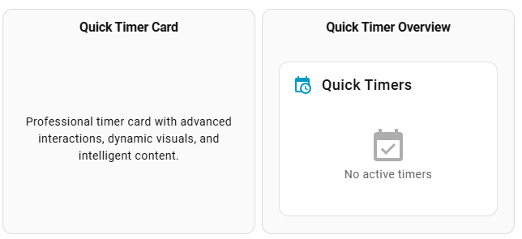
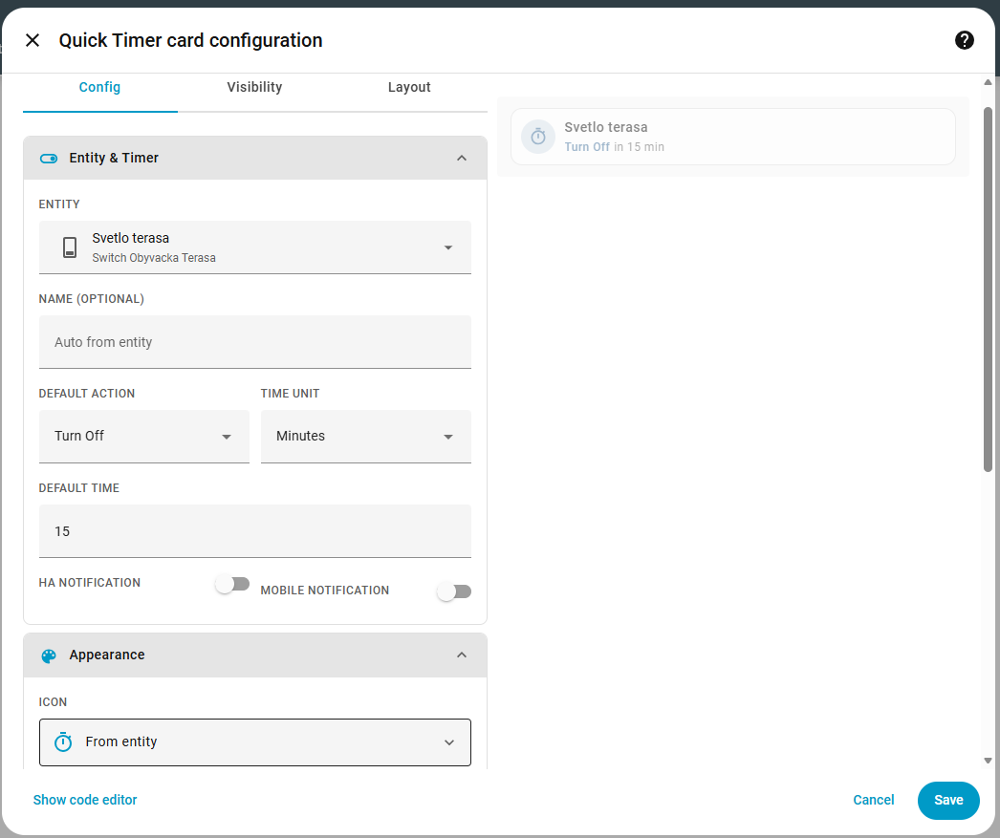
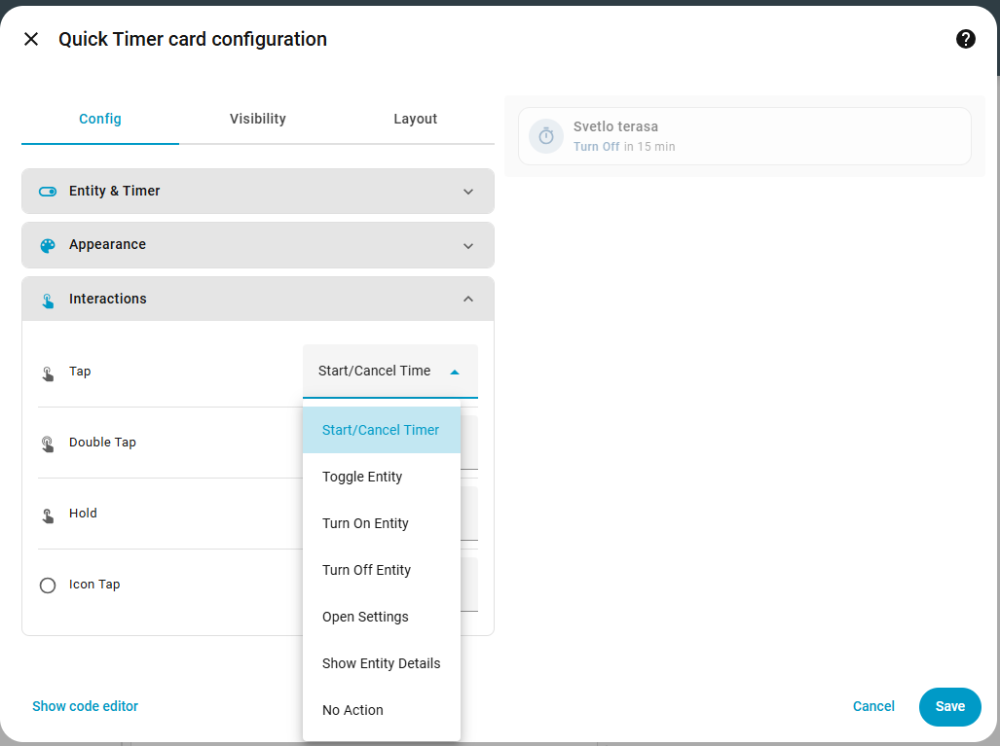
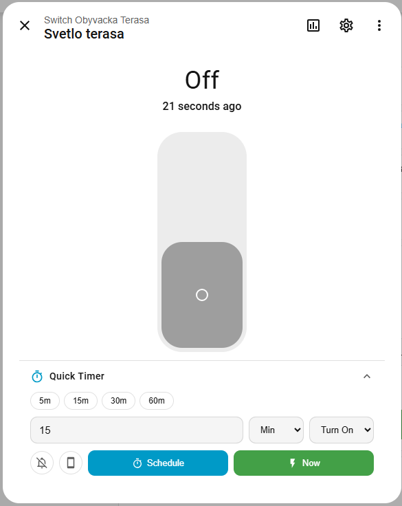
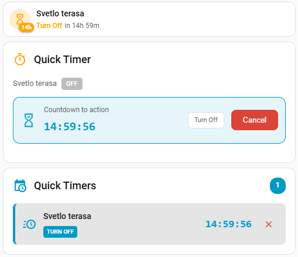

# Quick Timer Card

## ⚠️ DEPRECATED

This card is deprecated as of core v2.0.0, which has integrated the card functionality in itself.

[](https://github.com/hacs/integration)
[](https://github.com/jozefnad/homeassistant-quick_timer_card/releases)
[](LICENSE)

If you find this integration useful, you can buy me a beer to help keep development going.

[](https://www.buymeacoffee.com/jozefnad)

**Quick Timer Card** is a custom Lovelace card for Home Assistant that provides an elegant UI for scheduling one-time actions with countdown timers.

> ⚠️ **Requirement:** This card requires the [Quick Timer integration](https://github.com/jozefnad/homeassistant-quick_timer) to be installed and configured.

## ✨ Features

- 🕐 **Countdown display** - Visual countdown with progress bar
- ⚡ **Quick actions** - Start/cancel timers with tap actions
- 🎨 **Dynamic visuals** - State-based colors and icons
- 📱 **Responsive design** - Compact and full modes
- 🔧 **Advanced editor** - Comprehensive configuration options
- 💉 **Dialog injection** - Automatic timer panel in entity dialogs

## 🖼️ Screenshots

### Card examples



### Configuration





### Dialog injection




### Scheduled timers



## 📦 Installation

### HACS (Recommended)

1. Open HACS in Home Assistant
2. Click on **Frontend**
3. Click the menu (⋮) in the top right corner
4. Select **Custom repositories**
5. Add URL: `https://github.com/jozefnad/homeassistant-quick_timer_card`
6. Category: **Lovelace**
7. Click **Add**
8. Search for "Quick Timer Card" and click **Download**
9. Restart Home Assistant

### Manual Installation

1. Download the latest release from [Releases](https://github.com/jozefnad/homeassistant-quick_timer_card/releases)
2. Copy `quick-timer-card.js` to your `/config/www/` folder
3. Go to **Settings** → **Dashboards** → **Resources** (⋮ menu)
4. Click **+ Add Resource**
5. URL: `/local/quick-timer-card.js`
6. Resource type: **JavaScript Module**
7. Click **Create**
8. Restart Home Assistant

## 🎨 Configuration

Add the card to your dashboard:

```yaml
type: custom:quick-timer-card
entity: light.living_room
name: Living Room Timer
default_delay: 30
default_unit: minutes
default_action: off
mode: compact  # or 'full'
```

### Configuration Options

| Option | Type | Required | Default | Description |
|--------|------|----------|---------|-------------|
| `type` | string | ✅ | - | `custom:quick-timer-card` |
| `entity` | string | ✅ | - | Entity ID |
| `name` | string | ❌ | From entity | Card name |
| `icon` | string | ❌ | From entity | Icon override |
| `color` | string | ❌ | "state" | Icon color |
| `mode` | string | ❌ | "compact" | Display mode: `compact` or `full` |
| `default_delay` | int | ❌ | 15 | Default delay |
| `default_unit` | string | ❌ | "minutes" | Default unit |
| `default_action` | string | ❌ | "off" | Default action |
| `notify_ha` | bool | ❌ | false | Enable HA notifications by default |
| `notify_mobile` | bool | ❌ | false | Enable mobile notifications by default |

## 🛠️ Troubleshooting

### Card not showing

- Ensure the [Quick Timer integration](https://github.com/jozefnad/homeassistant-quick_timer) is installed first
- Check that the resource is properly added in **Settings** → **Dashboards** → **Resources**
- Clear browser cache (Ctrl+F5)
- Check browser console for JavaScript errors

## 📝 License

This project is licensed under the MIT License - see the [LICENSE](LICENSE) file for details.

## 🤝 Contributing

Contributions are welcome! Please open an issue or pull request.

## ⭐ Support

If you like this project, please give it a star on GitHub!

---

**See also:** [Quick Timer Integration](https://github.com/jozefnad/homeassistant-quick_timer) - The backend integration required for this card to work.
